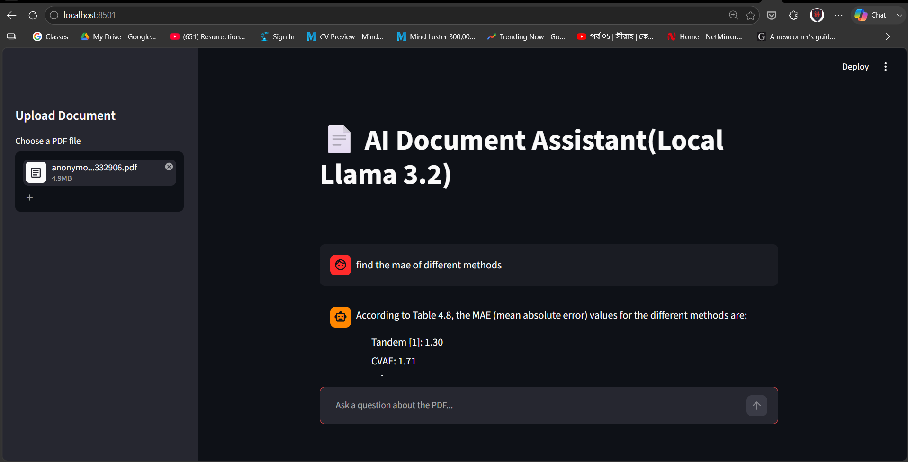

## 📄 AI-Powered Document Assistant (Local RAG with Llama 3.2)
An AI-powered document assistant that allows users to upload a PDF and ask natural language questions about its contents.

This project implements a Retrieval-Augmented Generation (RAG) pipeline using:

- ✅ Local embeddings (sentence-transformers)
- ✅ FAISS vector database
- ✅ Local LLM via Ollama (llama3.2)
- ✅ Streamlit user interface
- ✅ Persistent vector storage
- ✅ Streaming LLM responses
---
## Demo


## 🚀 Features
📄 Upload any PDF document
🔍 Semantic search using FAISS
🧠 Local LLM reasoning with Llama 3.2
⚡ Streaming AI responses
💾 Persistent vector storage (no re-indexing after first run)
🔒 Fully local (no API costs, no data leaves your machine)

## 🏗️ Architecture
```text
User Query
    ↓
Streamlit UI
    ↓
Pipeline (RAG Orchestrator)
    ↓
FAISS Vector Search
    ↓
Relevant Context Retrieval
    ↓
Llama 3.2 (via Ollama)
    ↓
Final Answer (Streaming)
```
# RAG Components	
	
| Component  | Purpose | 
|----------|----------|
| ingest.py   | Extracts and chunks text from PDF   | 
| embeddings.py   | Converts text into vector embeddings   | 
| retriever.py   | Stores and searches embeddings using FAISS   | 
| llm.py   | Generates answers using local LLM   | 
| pipeline.py   | Connects all components together   | 
| app.py   | Streamlit user interface   | 
---

## 🧰 Tech Stack
- Python 3.10+
- Streamlit
- FAISS (Vector Search)
- Sentence Transformers
- Ollama
- Llama 3.2 (Local LLM)
- PyMuPDF (PDF Parsing)
---

## 📦 Installation
- 1️⃣ Clone the Repository
```bash
git clone https://github.com/rafsun-jany-rafy/rag-doc-assistant.git
cd rag-doc-assistant
```
- 2️⃣ Create Virtual Environment
```bash
python -m venv .venv
```

Activate:

Windows
```bash
.venv\Scripts\activate
```

Mac/Linux
```bash
source .venv/bin/activate
```

- 3️⃣ Install Dependencies
```bash
pip install -r requirements.txt
```
---

## 🦙 Install and Setup Ollama
Download and install Ollama:
```bash
👉 https://ollama.com/
```

Then pull the model:
```bash
ollama pull llama3.2
```
Make sure Ollama is running in the background.

▶️ Run the Application
```bash
streamlit run app.py
```
The app will open in your browser.

- Upload a PDF
- Ask questions about the document
- Receive AI-generated answers
---

📁 Project Structure
```text

rag-doc-assistant/
│
├── data/
│   └── documents/          # Stores uploaded PDF documents
│
├── images/
│
├── notebooks/              # R&D and experiments
│
├── src/                    # Core Logic
│   ├── __init__.py
│   ├── ingest.py           # PDF extraction & chunking
│   ├── embeddings.py       # Vector generation
│   ├── retriever.py        # FAISS storage & search logic
│   ├── llm.py              # Local LLM (Ollama) configuration
│   └── pipeline.py         # Orchestration layer
│
├── vectorstore/            # Saved FAISS index files
│
├── .gitignore
├── app.py                  # Streamlit Web Interface
├── LICENSE
├── requirements.txt        # Project dependencies
└── README.md
```
---

## ⚙️ Optimization Implemented
✅ Chunk overlap for better context preservation
✅ Persistent FAISS index per document
✅ Streaming LLM responses
✅ Modular architecture
✅ Multi-document support
---

## 📊 Example Use Cases
- Research paper analysis
- Technical documentation assistant
- Academic PDF summarizer
- Internal company knowledge base
- AI study companion
---

## 🧠 Future Improvements
- FastAPI backend
- Docker containerization
- Cloud deployment
- Hybrid search (BM25 + vector search)
- Cross-encoder reranking
- Conversational memory
- Multi-document querying
- Authentication layer
---

## ⚠️ Notes
- The first query on a new document may take longer due to indexing.
- All processing is local — no cloud API required.
- Large PDFs may require more RAM.

## 📜 License
MIT License

## 👨‍💻 Author
Built as part of a hands-on exploration into building production-ready Retrieval-Augmented Generation systems.

## ⭐ Support
If you like this project, give it a ⭐ on GitHub.

